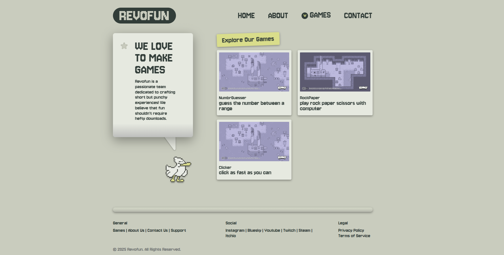
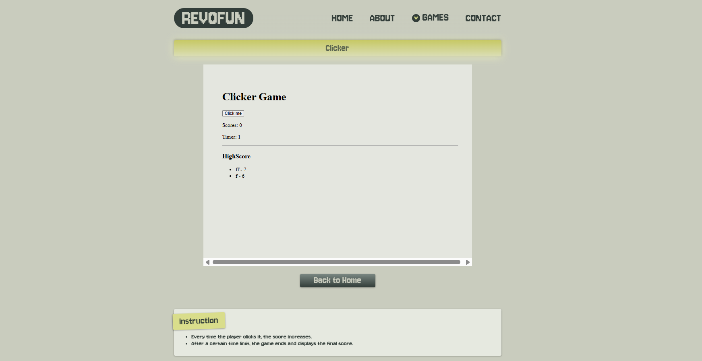

  

  <h3 align="center">REVOFUN</h3>

  

    A Project for Revou Full Stack Software Engineering Bootcamp
     
     
    <a href="https://transcendent-cobbler-62d630.netlify.app/">View Demo</a>
    &middot;
    <a href="https://github.com/revou-fsse-feb25/milestone-2-rizaldi-r/issues/new?labels=bug">Report Bug</a>
    &middot;
    <a href="https://github.com/revou-fsse-feb25/milestone-2-rizaldi-r/issues/new?labels=enhancement">Request Feature</a>
  

<!-- TABLE OF CONTENTS -->

  
Table of Contents

  <ol>
    <li><a href="#about">Description</a></li>
    <li><a href="#features">Features</a></li>
    <li><a href="#screenshots">Screenshots</a></li>
    <li><a href="#stack">Tech Stack</a></li>
    <li><a href="#links">Links</a></li>
    <li><a href="#authors">Author</a></li>
  </ol>

### About 

Revofun is a fictional game studio dedicated to creating fun and engaging browser games. This project was developed as part of the Revou Full Stack Software Engineering Bootcamp.
 

### Features 

-   Cross platform
-   Simple games

(<a href="#readme-top">back to top</a>)

### Screenshots 

(<a href="#readme-top">back to top</a>)

### Build With 

&emsp; 
&emsp; 
&emsp; 
&emsp; 

(<a href="#readme-top">back to top</a>)

### Links 
&emsp; Published project : https://transcendent-cobbler-62d630.netlify.app/

(<a href="#readme-top">back to top</a>)

### Author 

&emsp; [@rizaldi-r](https://github.com/rizaldi-r)

(<a href="#readme-top">back to top</a>)

